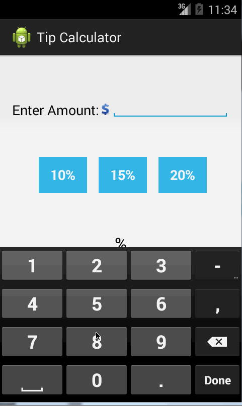

Tip calculator
===============

This is the first assignment app of Android Boot Camp.

Time spent: 10 hours spent in total

Completed user stories:

-  (Required) User is displayed the tip of specified percentage for specified entered amount 
-  (Required) User enters the total amount of the transaction
-  (Required) User can select between tip amounts (i.e 10%, 15%, 20%)
-  (Required) Upon selecting tip amount, formatted tip value is displayed
-  (Optional) User changes the total amount and updated tip is reflected automatically 
-  (Optional) User can select custom tip percentage if desired 
-  (Optional) Experiment with trying input widgets to replace the buttons and/or textviews
-  (Optional) Improve the user interface and experience by using images and/or colors
 
Walkthrough of all user stories:

